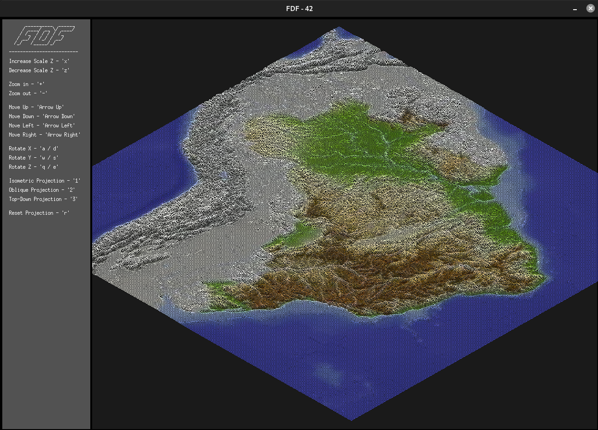
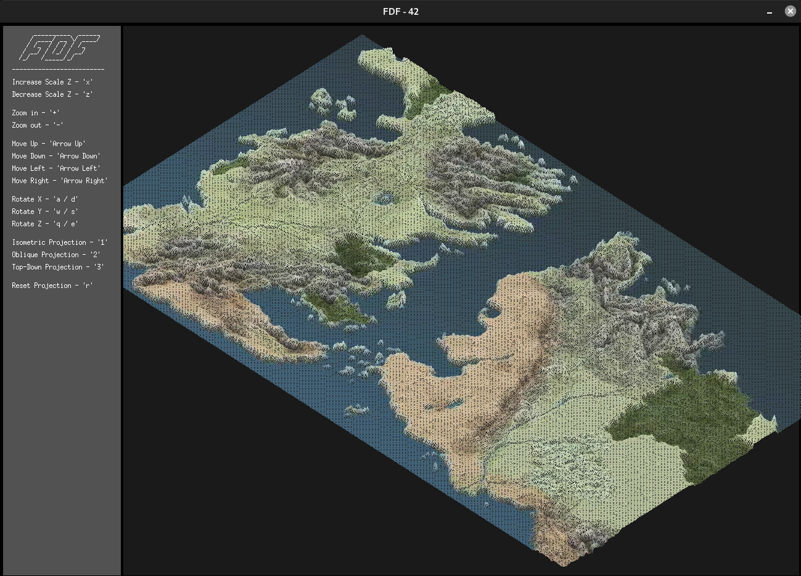
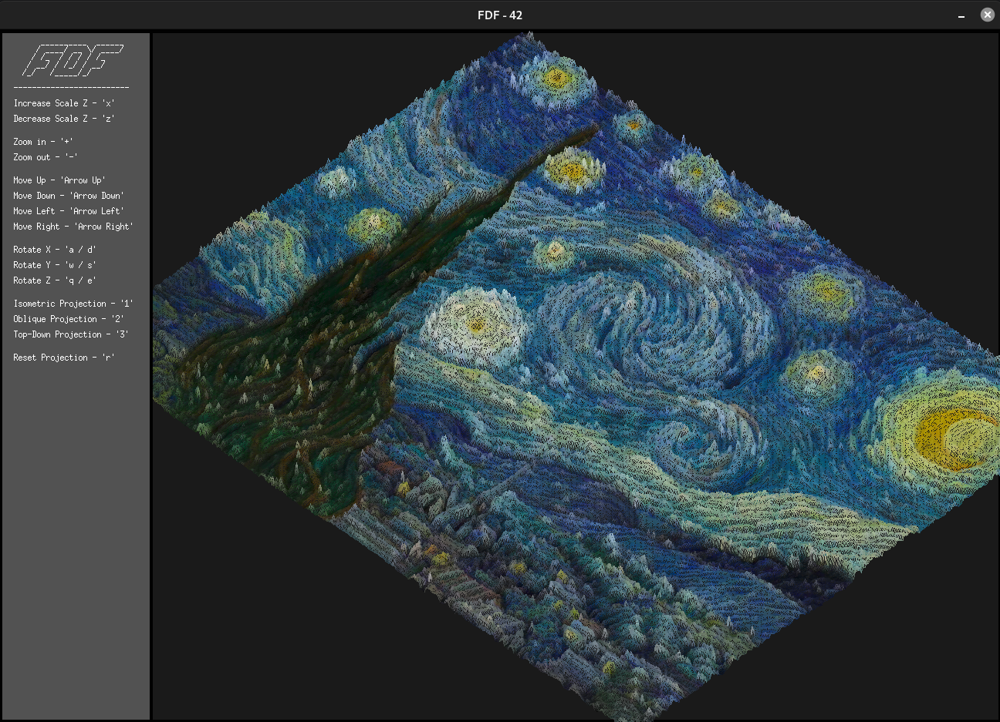
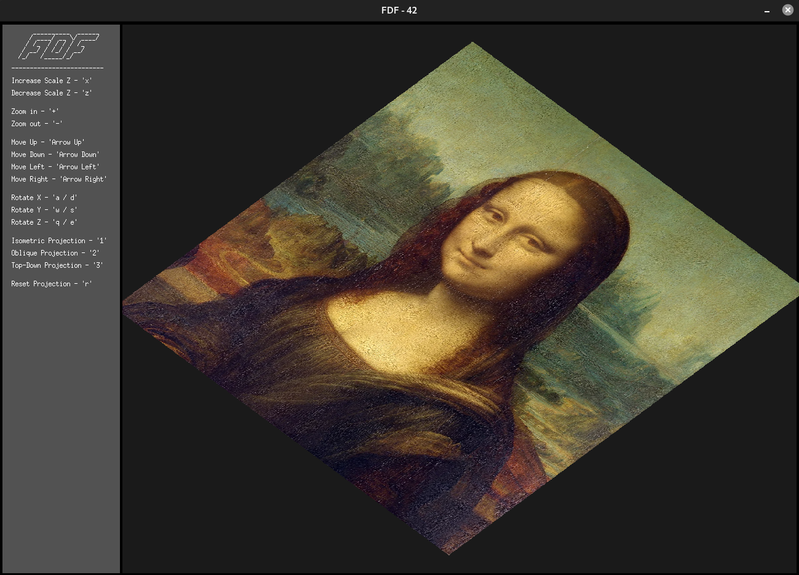

<div align="center"><h1>FdF [125 / 100]</h1></div>

<div align="center">
   <a href="https://github.com/ArthurSobreira/42_fdf" target="_blank">
      
   </a>
</div>

## Summary
> <i>The fifth project in the 42sp fundamentals track, <strong>Fdf</strong>, is also the first graphical project in the fundamentals track, </i>
> <i>which uses a simple graphics library called <strong>MinilibX</strong>. The project is based on the creation of a program that receives </i>
> <i>as a parameter a path to a map (any valid map with '.fdf' extension) and displays it in a Three-Dimensional Representation of Relief Landscapes. </i>

<br>

## The Project
<br>
<div align="center">
   <a href="https://github.com/ArthurSobreira/42_fdf/blob/master/images/42_map.png" target="_blank">
      
   </a>
</div>
<br>
<div align="center">
   <a href="https://github.com/ArthurSobreira/42_fdf/blob/master/images/whole-world_map.png" target="_blank">
      
   </a>
</div>
<br>
<div align="center">
   <a href="https://github.com/ArthurSobreira/42_fdf/blob/master/images/elem-fract_map.png" target="_blank">
      
   </a>
</div>

<br>

## Run the Program
* Make sure you clone the repository with the following command:
```bash
$> git clone git@github.com:ArthurSobreira/42_fdf.git
```

* Once cloned, to compile and run the program, use the following commands:
```bash
$> make bonus
$> ./fdf_bonus ./maps/<map-name>.fdf
```

<br>

## Generate Map From Image
* First of all, you need to install the <strong>Pillow</strong> package, with the following command:
```bash
$> pip install Pillow
```

* Now, to create properly formatted maps that can be read by <strong>Fdf</strong>, simply have access to an image (PNG or JPG)
  and run the script <code>create_map.py</code> with the following command:
```bash
$> python3 create_map.py
$>
$> Enter the image path: <image-name>
$> Enter the name that the image will be saved: <map-name>.fdf
```

* Once the map is created, to render it just execute the command seen previously, with this it is possible to generate some really cool maps, like these:
<br>
<div align="center">
   <a href="https://github.com/ArthurSobreira/42_fdf/blob/master/images/brazil.png" target="_blank">
      
   </a>
   <a href="https://github.com/ArthurSobreira/42_fdf/blob/master/images/got_map.png" target="_blank">
      
   </a>
</div>

<br>
  
<div align="center">
   <a href="https://github.com/ArthurSobreira/42_fdf/blob/master/images/van-gogh.png" target="_blank">
      
   </a>
   <a href="https://github.com/ArthurSobreira/42_fdf/blob/master/images/monalisa.png" target="_blank">
      
   </a>
</div>
