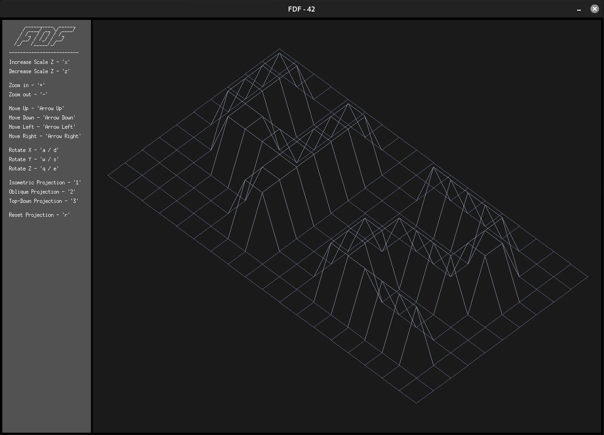
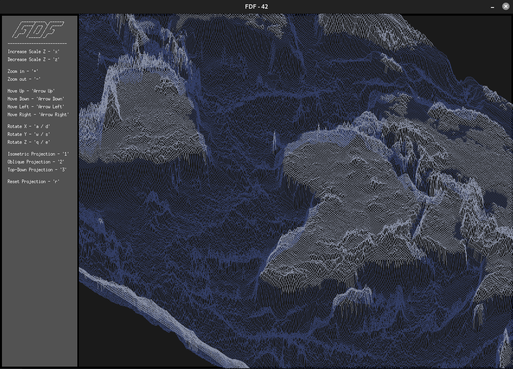
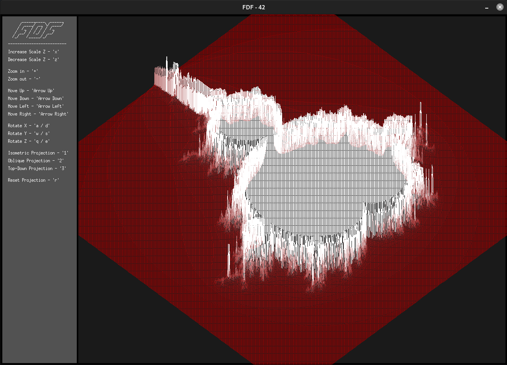

<div align="center"><h1>FdF [125 / 100]</h1></div>

<div align="center">
   <a href="https://github.com/ArthurSobreira/42_fdf" target="_blank">
      
   </a>
</div>

## Summary

> <i>The fifth project in the 42sp fundamentals track, <strong>Fdf</strong>, is also the first graphical project in the fundamentals track, </i>
> <i>which uses a simple graphics library called <strong>MinilibX</strong>. The project is based on the creation of a program that receives </i>
> <i>as a parameter a path to a map (any valid map with '.fdf' extension) and displays it in a Three-Dimensional Representation of Relief Landscapes. </i>

<br>
<div align="center">
   <a href="https://github.com/ArthurSobreira/map_generator_fdf" target="_blank">
      
   </a>
</div><br>

## The Project

<br>
<div align="center">
   <table>
     <tr>
       <td style="border: 5px solid darkgray;">
          <a href="https://github.com/ArthurSobreira/42_fdf/blob/master/images/42_map.png" target="_blank">
            
          </a>
       </td>
     </tr>
   </table>
</div>
<br>
<div align="center">
   <table>
     <tr>
       <td style="border: 5px solid darkgray;">
         <a href="https://github.com/ArthurSobreira/42_fdf/blob/master/images/whole-world_map.png" target="_blank">
            
          </a>
       </td>
     </tr>
   </table>
<br>
<div align="center">
   <table>
     <tr>
       <td style="border: 5px solid darkgray;">
         <a href="https://github.com/ArthurSobreira/42_fdf/blob/master/images/elem-fract_map.png" target="_blank">
            
          </a>
       </td>
     </tr>
   </table>
</div><br>

<div align="center">
   <i><h3>Zoom In / Out</h3></i>
   <a href="https://github.com/ArthurSobreira/42_fdf/blob/master/images/fdf_zoom.gif" target="_blank">
      
   </a>
</div>
<div align="center">
   <i><h3>Rotate X</h3></i>
   <a href="https://github.com/ArthurSobreira/42_fdf/blob/master/images/fdf_rotateX.gif" target="_blank">
      
   </a>
</div>
<div align="center">
   <i><h3>Rotate Y</h3></i>
   <a href="https://github.com/ArthurSobreira/42_fdf/blob/master/images/fdf_rotateY.gif" target="_blank">
      
   </a>
</div>
<div align="center">
   <i><h3>Rotate Z</h3></i>
   <a href="https://github.com/ArthurSobreira/42_fdf/blob/master/images/fdf_rotateZ.gif" target="_blank">
      
   </a>
</div>
<div align="center">
   <i><h3>Increase / Decrease Z Scale</h3></i>
   <a href="https://github.com/ArthurSobreira/42_fdf/blob/master/images/fdf_increaseZ.gif" target="_blank">
      
   </a>
</div><br>
</div>

## Run the Program

* Make sure you clone the repository with the following command:

``` bash
$> git clone git@github.com:ArthurSobreira/42_fdf.git
```

* Once cloned, to compile and run the program, use the following commands:

``` bash
$> make bonus
$> ./fdf_bonus ./maps/<map-name>.fdf
```

<br>
